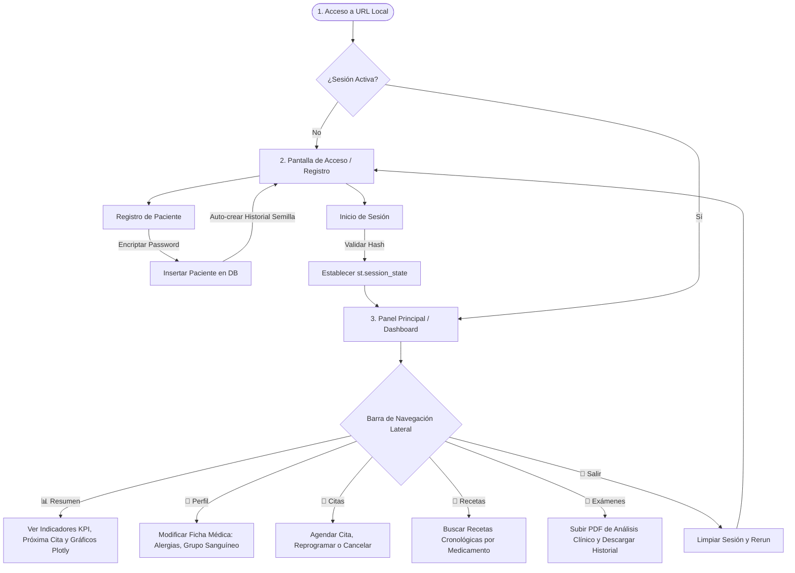
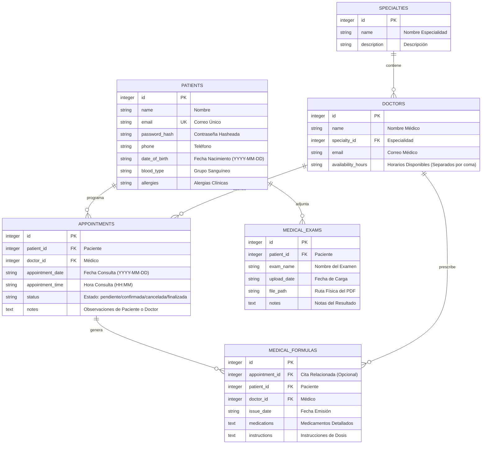

# VitalIS - Portal de Salud & Gestión de Citas Médicas 🩺

VitalIS es una plataforma integral de salud orientada a pacientes que permite gestionar de forma centralizada y segura toda la información médica, agendamiento de citas, visualización de recetas históricas y control de exámenes clínicos (PDF) en un entorno local y modular de alto rendimiento.

Construido utilizando únicamente **Python** y **Streamlit** bajo una arquitectura de **Monolito Modular**, el sistema garantiza un desacoplamiento estricto entre el almacenamiento, la lógica de negocio y la interfaz de usuario.

---

## 🚀 Guía de Inicio Rápido

### 1. Requisitos Previos
Asegúrese de tener instalado Python 3.10 o superior en su sistema operativo (Windows/macOS/Linux).

### 2. Instalación de Dependencias
Instale las librerías necesarias ejecutando el siguiente comando en su terminal:
```bash
pip install -r requirements.txt
```

### 3. Ejecución de la Aplicación
Inicie el servidor local de Streamlit desde la carpeta raíz del proyecto:
```bash
streamlit run src/app.py
```
La aplicación se abrirá automáticamente en su navegador web en `http://localhost:8501`.

---

## 📂 Estructura Detallada del Proyecto

El proyecto está diseñado bajo un esquema monolítico modular limpio, conteniendo los siguientes componentes clave:

```text
C:\Users\mao11\Documents\curso-github\
├── requirements.txt           # Dependencias requeridas (streamlit, pandas, plotly)
├── README.md                  # Este archivo de documentación técnica completa
├── database.db                # Base de datos relacional SQLite (auto-generada al iniciar)
├── uploads/                   # Carpeta segura local para almacenamiento físico de PDFs de exámenes
└── src/
    ├── __init__.py            # Inicializador de módulo Python
    ├── read.py                # CAPA 1: Persistencia de Datos (CRUD y SQLite DAL)
    ├── process.py             # CAPA 2: Lógica de negocio, validaciones clínicas y analítica de datos (BLL)
    └── app.py                 # CAPA 3: Interfaz de usuario interactiva y estilos CSS (Presentation)
```

### Roles de los Archivos Principales
1. **`src/read.py` (Capa de Acceso a Datos)**: 
   - Define el esquema relacional SQLite.
   - Inicializa las tablas si no existen y carga los **datos semilla** (especialidades y médicos).
   - Realiza consultas transaccionales puras parametrizadas (para mitigar vulnerabilidades de Inyección SQL).
2. **`src/process.py` (Capa de Lógica de Negocio)**:
   - Administra el flujo criptográfico de registro y login (Hashing SHA-256 + sal dinámico).
   - Evalúa reglas de agendamiento y reprogramación (impide sobrelapamiento de horarios de médicos y pacientes).
   - Procesa estadísticas del paciente y análisis clínico de datos mediante `pandas`.
   - Gestiona el almacenamiento físico seguro de archivos PDF en la carpeta `uploads/`.
3. **`src/app.py` (Capa de Presentación)**:
   - Inyecta una hoja de estilo CSS personalizada para transformar el diseño estándar de Streamlit en un portal premium.
   - Controla los estados de sesión (`st.session_state`) para asegurar rutas protegidas.
   - Renderiza dashboards interactivos con gráficos analíticos interactivos usando `plotly.express`.
   - Ofrece formularios intuitivos para registro, reserva y carga de documentos clínicos.

---

## 🔄 Flujo de Funcionamiento de la Aplicación



---

## 📊 Modelo de Datos Relacional (SQLite)

El sistema utiliza una base de datos relacional para forzar consistencia de datos clínicos mediante llaves foráneas (`FOREIGN KEY`) y borrado en cascada.



---

## 🔒 Recomendaciones de Seguridad y Privacidad Médica

Al gestionar datos de salud (PHI - *Protected Health Information*), se implementan medidas de seguridad esenciales basadas en estándares internacionales de privacidad clínica (tales como **HIPAA** y **GDPR**):

1. **Hashing Unidireccional de Credenciales**: Las contraseñas se almacenan mediante hashes criptográficos SHA-256 junto con un salt aleatorio único por usuario. Esto previene que una filtración de base de datos comprometa las contraseñas de los usuarios.
2. **Defensa contra Inyecciones SQL**: La totalidad de llamadas SQL en `read.py` se realizan mediante consultas preparadas con comodines (`?`). Nunca se concatenan variables en strings SQL directos.
3. **Control de Acceso Basado en Sesión**: Las vistas están protegidas en el backend mediante variables de estado locales del servidor (`st.session_state`). Un usuario no logueado no puede acceder a las pantallas del portal ni descargar archivos PDF de la base de datos.
4. **Ofuscación y Anonimización de Archivos PDF**: Los exámenes clínicos subidos se renombran físicamente utilizando UUIDs únicos (ej: `exam_1_a2b3c4d5...pdf`) y se enrutan en una carpeta protegida para evitar la predecibilidad de archivos o ataques de sobreescritura.
5. **Principio de Mínimo Privilegio**: La base de datos local SQLite tiene habilitadas las llaves foráneas (`PRAGMA foreign_keys = ON`) para que las eliminaciones de cuentas de pacientes limpien inmediatamente todo rastro clínico de citas, fórmulas y archivos del disco rígido en cascada.

---

## 🎨 Sugerencias de Diseño UI/UX en Streamlit

Para ofrecer una experiencia interactiva moderna y con sensación de aplicación web premium, hemos incorporado:
* **Google Fonts**: Inyección de la tipografía premium **Outfit** para romper la visual por defecto del navegador.
* **Componentes Tipo Tarjeta (KPIs)**: Diseñados mediante CSS con bordes sutiles transparentes, sombras flotantes y micro-animaciones al pasar el cursor (`hover`) que dan dinamismo a las estadísticas.
* **Badges Semánticos**: Uso de colores condicionales según el estado clínico de la cita (`pendiente` en amarillo cálido, `confirmada` en verde clínico, `cancelada` en rojo coral y `finalizada` en azul quirúrgico).
* **Sidebar Informativo**: Panel lateral limpio con indicador visual de paciente activo, avatar e información directa de emergencias.
* **Interactividad Visual**: Gráficos analíticos renderizados en tiempo real mediante Plotly que permiten interactuar (hacer zoom, aislar variables o ver descripciones emergentes).

---

## 🔮 Posibles Mejoras Futuras

El diseño actual del **Monolito Modular** permite que VitalIS sea altamente escalable hacia futuras expansiones:
1. **Telemedicina Integrada**: Incorporar salas de videoconsulta directa embebidas en el portal del paciente utilizando WebRTC.
2. **Integración con Pasarelas de Pago**: Habilitar el pago electrónico seguro de copagos médicos (Stripe/PayPal) al momento de agendar citas.
3. **Recordatorios Automatizados (SMS/WhatsApp)**: Desarrollar un servicio en segundo plano (Worker) que envíe notificaciones automatizadas a los teléfonos de los pacientes 24 horas antes de su cita médica.
4. **Módulo Multiusuario (Médicos/Administrativos)**: Expandir el sistema con vistas de rol para Médicos (donde puedan ver su agenda diaria y expedir fórmulas de forma interactiva en la base de datos) y Administradores (para gestionar horarios médicos y catálogos de especialidades).
5. **Autenticación Multifactor (MFA)**: Agregar un segundo factor de autenticación por correo electrónico o códigos OTP telefónicos para robustecer la seguridad del acceso al portal.
